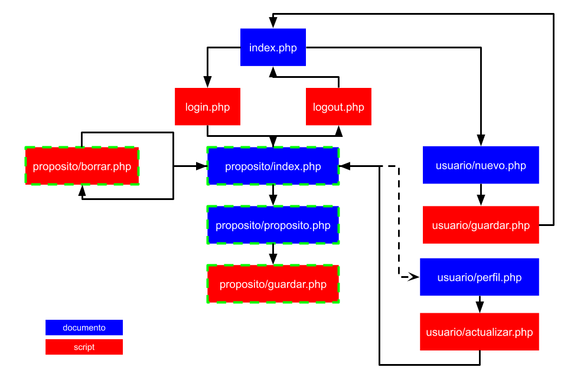

# Instrucciones

### Base de datos

* Tabla usuarios
  * id  (int, llave primaria, auto incrementable)
  * email (varchar 100)
  * nombre (varchar 100)
  * password (hash, varchar 32)  
  * creacion (datetime)
  * actualizacion (datetime)
  
* Tabla propositos
  * id  (int, llave primaria, auto incrementable)
  * id_usuario (int, llave foránea)
  * proposito (varchar 150)
  * vencimiento (date)

### Aplicación

#### Requerimientos no funcionales
1. Impedir registro de usuarios duplicados validando con el e-mail.
2. Permitir a usuarios registrados y autenticados crear, actualizar y borrar sus propósitos de año nuevo.
3. La contraseña del usuario no debe ser almacenada en texto plano sino en hash (md5).
4. En las pantallas proposito/index.php, proposito/proposito.php y usuario/perfil.php debe mostrarse en la esquina superior derecha el e-mail del usuario autenticado.
5. Los datos de texto del propósito y fecha de vencimiento deben ser obligatorios.
6. En el perfil el nombre del usuario es obligatorio, sin embargo, la contraseña puede o no ser cambiada.
7. Permitir registrar una fotografía del usuario.
8. Permitir registrar una imagen del propósito.

#### Directorio raíz 
* index.php - pantalla inicial
* login.php - proceso de identificación y autenticación de usuarios
* logout.php - proceso de cierre de sesión

#### Directorio usuario
* nuevo.php - formulario de registro de usuarios nuevos
* guardar.php - proceso para guardar nuevos usuarios
* perfil.php - formulario con datos del usuario
* actualizar.php - proceso de actualización de los datos del usuario

#### Directorio propósitos
* index.php - lista de propósitos registrados
* proposito.php - formulario de captura de propósitos
* guardar.php - proceso para guardar propósitos
* borrar.php - proceso para eliminar propósitos

### Diagrama

